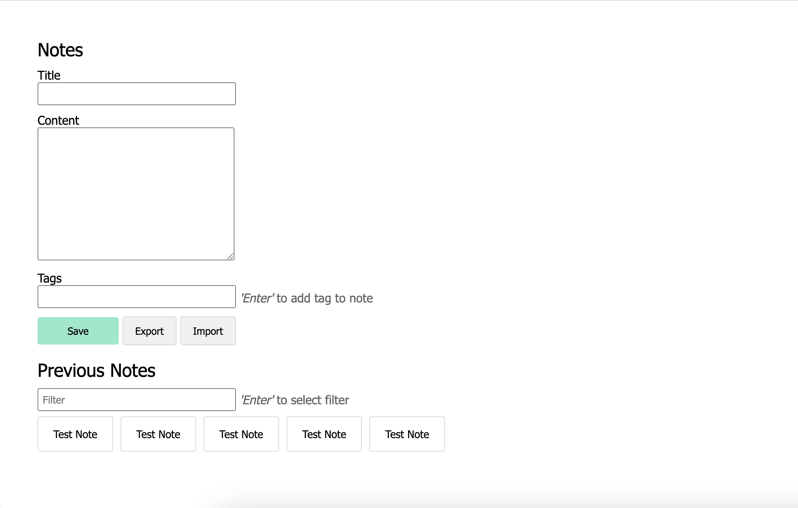

# Notat-app

Dette er en applikasjon for å skrive og holde orden på notater.

Du kan eksportere og importere notater med JSON, og filtrere etter notater med tags.

På hvert notat kan du se:

- Tittel
- Opprettelses tid
- Sist endret
- Innhold
- Tags

Appen fungerer uten internett.

## Hovedfunksjoner

- **Opprettelse av notat:** For å opprette et notat, må du fylle inn feltene for 'title' og 'content'.

- **Tags:** Du kan legge til tags for å gjøre det enklere å organisere og finne notatene dine senere. Skriv inn tags i det tilhørende feltet og trykk 'enter'.

- **Lagring:** For å lagre notatet, klikk på 'save'.

- **Visning og redigering:** Dine eksisterende notater finner du under 'Previous Notes'. Klikk på et notat for å se eller redigere det. Å endre tittelen på et notat vil resultere i opprettelsen av et nytt notat.

- **Eksport og import:** Eksporter notater til JSON-format ved å klikke på 'export'. Importer notater ved å klikke på 'import', pass på at notatet ikke har samme tittel som et eksisterende notat under 'Previous Notes'.

- **Filtrering:** Filtrer notatene dine ved å skrive inn i filter-feltet og bekreft med 'enter'. For mer spesifikke søk, bruk '#' foran tagget du vil søke etter, dette vil gi deg mer presise resultater knyttet til det spesifikke tagget.

## Installasjonsveiledning

**1. Klon Repositoriet:** Start med å klone repositoriet til din lokale maskin.

**2. Installer Avhengigheter:** Naviger til prosjektmappen i terminalen og kjør linjene under for å installere avhengigheter.

    npm install

---

    npm install express

---

    npm install sqlite3

**3. Start Serveren:** Kjør kommandoen under for å starte serveren. Serveren vil kjøre på port 3000, slik at du kan få tilgang til appen via `http://localhost:3000` i nettleseren.

    node index.js

### Eksterne filer

[Se brukertestresultater](assets/brukertest.pdf)
